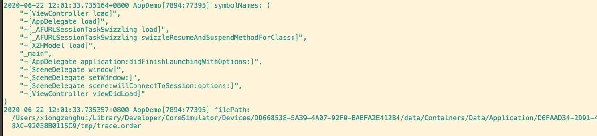

## Installation

### 1. 集成组件

```ruby
pod 'iOSOrderFile', git: 'https://github.com/xzhhe/iOSOrderFile.git', branch: 'master'
```

### 2. 添加 pod targets 编译设置

```ruby
post_install do |installer|
  installer.pods_project.targets.each_with_index do |target, _index|
    target.build_configurations.each do |config|
      config.build_settings['OTHER_CFLAGS'] = '-fsanitize-coverage=func,trace-pc-guard'
      config.build_settings['OTHER_SWIFT_FLAGS'] = '-sanitize-coverage=func -sanitize=undefined'
    end
  end
end
```

### 3. 添加 App target 编译设置

如果你的项目只是 objc 添加如下即可:


如果你的项目还有 swift 代码, 还需要添加如下设置:

- Other Swift Flags
  - `-sanitize-coverage=func`
  - `-sanitize=undefined`

如果还是不会加，百度搜下即可 ~

## Example

### 1. 在你的 App 项目中, 调用生成 order file

```objective-c
#import "ViewController.h"
#import <iOSOrderFile/iOSOrderFile.h>

@implementation ViewController

+ (void)load {
  NSLog(@"222");
}

- (void)viewDidLoad {
  [super viewDidLoad];

  /**
   * 生成 order file
   */
  generate_order_file();
}

@end
```

### 2. 跑起你的项目



- 就可以看到搜集到的符号输出了
- `filePath:` 对应的就是 生成的 order file 文件的路径


## Author

xiongzenghui, zxcvb1234001@163.com

## License

iOSOrderFile is available under the MIT license. See the LICENSE file for more info.
